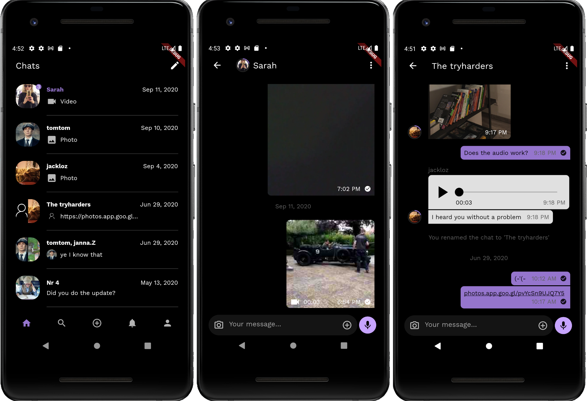

# A complete Flutter chat UI kit

[](https://pub.dev/packages/chat_ui_kit)

This Flutter package provides you with a base structure as well as a set of tools that allow you to quickly build up a modern chat UI.
Instead of trying to come up with all in one Widgets that meet everyone's expectations, you are given helpers that are meant to be used as examples and customized at will.

<p align="center">

</p>


## Features

- Support for group conversations
- List of conversations (chats)
- Group avatar
- Unread messages badge
- Message title (user)
- Message avatar
- Adaptive message containers depending on relative positioning
- Controllers with data management api (add, remove, update)
- Automated selection management
- Message input with typing events
- Examples for text, image, audio and video messages

## Getting Started

First add the following line to your pubspec.yaml dependencies:
```dart
chat_ui_kit: ^[latest_version]
```

Next, setup your models to extend the base models:

```dart
class ChatMessage extends MessageBase {
  //...

  ChatUser author;
  String text;

  @override
  DateTime get createdAt =>
      DateTime.fromMillisecondsSinceEpoch(creationTimestamp);

  @override
  String get id => messageId;

  @override
  String get url => attachment;

  @override
  MessageBaseType get messageType {
    //...
  }
}
```

```dart
class ChatUser extends UserBase {
  //...

  @override
  String get name => username;

  @override
  String get id => userid;

  @override
  String get avatar => avatarURL;
}
```

```dart
class Chat extends ChatBase {
  
  //...

  List<ChatUser> members;
  ChatMessage lastMessage;

  @override
  int get unreadCount => chat.unreadCount;

  @override
  String get name {
    if ((chat?.name ?? null).isNotNullOrEmpty()) return chat.name;
    return membersWithoutSelf.map((e) => e.username).toList().join(", ");
  }

  @override
  String get id => chat?.id;

  @override
  List<ChatUser> get membersWithoutSelf {
    List<ChatUser> membersWithoutSelf = [];
    final localUserId = chat?.localUserId ??
        FirebaseAuth.instance.currentUser?.uid;
    for (ChatUser chatUser in members) {
      if (localUserId != chatUser.userid) membersWithoutSelf.add(chatUser);
    }
    return membersWithoutSelf;
  }
  
}
```

## ChatsListScreen

```dart
ChatsListController controller = ChatsListController();

ChatsList(
    controller: _controller,
    appUserId: _currentUser.id,
    scrollHandler: _handleScrollEvent,
    groupAvatarStyle: GroupAvatarStyle(withSeparator: true),
    builders: ChatsListTileBuilders(
        groupAvatarBuilder:
            (context, imageIndex, itemIndex, size, item) {
          final chat = item as Chat;
          return CachedNetworkImage(
              cacheManager: CustomCacheManager(),
              imageUrl: chat.membersWithoutSelf[imageIndex].avatar,
              width: size.width,
              height: size.height,
              fit: BoxFit.cover,
              errorWidget: (ctx, url, val) =>
                  AppErrorWidget(true, size: size));
        },
        lastMessageBuilder: _buildLastMessage,
        wrapper: _buildTileWrapper,
        dateBuilder: (context, date) => Padding(
            padding: EdgeInsets.only(left: 16),
            child: Text(DateFormatter.getVerboseDateTimeRepresentation(
                context, date)))))

@override
void dispose() {
  _controller.dispose();
  super.dispose();
}
```

## ChatScreen

```dart
final MessagesListController _controller = MessagesListController();

@override
void initState() {
  _controller.selectionEventStream.listen((event) {
    setState(() {
      _selectedItemsCount = event.currentSelectionCount;
    });
  });
  super.initState();
}

Widget _buildMessagesList() {
  IncomingMessageTileBuilders incomingBuilders = _isGroupChat
      ? IncomingMessageTileBuilders(
          bodyBuilder: (context, index, item, messagePosition) =>
              _buildMessageBody(context, index, item, messagePosition,
                  MessageFlow.incoming),
          avatarBuilder: (context, index, item, messagePosition) {
            final _chatMessage = item as ChatMessage;
            return Padding(
                padding:
                    EdgeInsets.only(right: 16),
                child: _buildAvatarWithScore(_chatMessage.author));
          })
      : IncomingMessageTileBuilders(
          bodyBuilder: (context, index, item, messagePosition) =>
              _buildMessageBody(context, index, item, messagePosition,
                  MessageFlow.incoming),
          titleBuilder: null);

  return Expanded(
      child: MessagesList(
          controller: _controller,
          appUserId: _currentUser.id,
          useCustomTile: (i, item, pos) {
            final msg = item as ChatMessage;
            return msg.isTypeEvent;
          },
          messagePosition: _messagePosition,
          builders: MessageTileBuilders(
              customTileBuilder: _buildEventMessage,
              customDateBuilder: _buildDate,
              incomingMessageBuilders: incomingBuilders,
              outgoingMessageBuilders: OutgoingMessageTileBuilders(
                  bodyBuilder: (context, index, item, messagePosition) =>
                      _buildMessageBody(context, index, item,
                          messagePosition, MessageFlow.outgoing)))));
}

@override
void dispose() {
  _controller.dispose();
  super.dispose();
}
```

## More

Please make sure to browse the class inlined documentation before asking any questions.
PRs are very welcome!